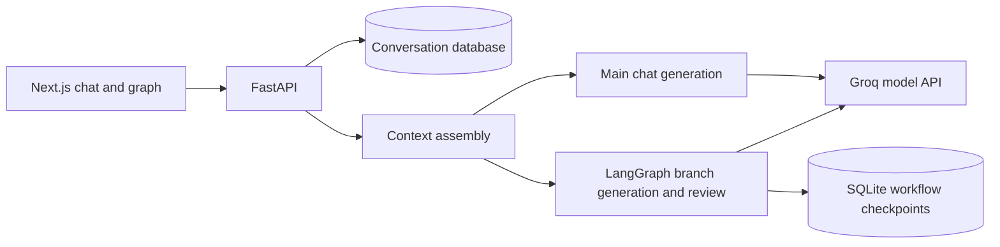

# InlineGraph AI

InlineGraph AI is a local chat application for exploring selected parts of AI answers. Ask open-ended questions about one or more selected text ranges, continue each exploration in its own branch, and accept useful branch exchanges as context for a later main-chat question.

It is an LLM-powered application with a fixed, orchestrated branch workflow. It is not a general autonomous agent: it does not independently choose goals, use external tools, or take actions on a user's behalf. See the [implementation guide](docs/product-spec.md) for the current behavior and known limitations.

## Features

- Ask questions in a main chat with persisted history.
- Select arbitrary text ranges, combine selections from the same answer, and ask a free-form question in a popup.
- Continue, accept, or reject branch discussions.
- Carry branch exchanges into later prompts, with accepted responses prioritized as context.
- Inspect questions, answers, selections, branch replies, and context connections in an interactive graph.
- Inspect new API and model requests with the session-only **See logs** debugger.
- Try the interface without an API key using mock mode.

## Local development

Requirements: Node.js 20.9 or newer, pnpm 9 or newer, and Python 3.11 or newer. Python 3.12 is recommended.

Run these commands from the cloned repository root. On macOS, use `python3` to create the virtual environment; activating it makes `python`, `pip`, and `uvicorn` available in that terminal.

1. Copy `.env.example` to `.env` and put your Groq API key in `GROQ_API_KEY`. The key is read only by the API and is ignored by Git. Leave it empty to try mock mode.

   ```sh
   cp .env.example .env
   ```
2. Install and start the API:

   ```sh
   cd apps/api
   python3 -m venv .venv
   . .venv/bin/activate
   pip install -r requirements.txt
   uvicorn app.main:app --reload --host 127.0.0.1 --port 8000
   ```

3. In another terminal, install and start the web app:

   ```sh
   cd apps/web
   pnpm install
   pnpm dev
   ```

4. Open http://localhost:3000. The FastAPI health endpoint is at http://localhost:8000/api/health.

The application starts in mock mode when `GROQ_API_KEY` is empty. Set a valid key and restart the API to use `qwen/qwen3.8-27b` through Groq. Set `LLM_MODE=mock` to force mock mode or `LLM_MODE=groq` to require the provider key.

## First demo workflow

- Ask a question or use the seeded urban heat conversation.
- Highlight any phrase or several ranges in one answer. Use **Add another** to collect more text, then choose **Ask** and write any question in the pop-up.
- Continue the branch, inspect its selected text and advisory runtime review, then accept or reject it.
- Accepted branch answers are clearly marked and prioritized as context for the next main-chat question; the original answer is not rewritten.
- Earlier conversation and other branch exchanges are also included in later prompts as context.
- Graph view shows which branch replies were included in each later question's context.
- **See logs** opens a session-only debugger for new requests. It shows browser request details and model messages, parameters, responses, and context references returned by the backend. It does not include the provider API key. Treat prompt and response text as private conversation data.
- Open graph view to inspect question, answer, passage, and branch relationships.

## Architecture



- `apps/web`: Next.js, React, TypeScript, accessible responsive UI, and React Flow graph view.
- `apps/api`: FastAPI service, SQLAlchemy persistence, and a fixed LangGraph branch workflow that generates a response and runs an advisory model review.
- SQLite is the local default for a no-service startup. Set `DATABASE_URL` to a PostgreSQL SQLAlchemy URL to use PostgreSQL; a Compose service is provided for local PostgreSQL work.
- LangGraph checkpoints are stored in a separate local SQLite file. Keep application records and workflow checkpoints conceptually separate.
- Groq requests use an OpenAI-compatible endpoint from the backend. API keys are never passed to the browser.

## Environment

| Variable | Purpose |
|---|---|
| `GROQ_API_KEY` | Server-only Groq API key; blank means mock mode in `auto` mode |
| `GROQ_MODEL` | Model ID; defaults to `qwen/qwen3.8-27b` |
| `LLM_MODE` | `auto`, `groq`, or `mock` |
| `DATABASE_URL` | SQLAlchemy connection URL; local SQLite by default |
| `LANGGRAPH_CHECKPOINT_DB` | Separate workflow checkpoint database path |
| `NEXT_PUBLIC_API_BASE_URL` | Browser-visible FastAPI URL; defaults to `http://localhost:8000` |

## Current scope and limitations

- Text-based exploration uses an open-ended Ask prompt; users can request clarification, expansion, critique, or other analysis in their own words.
- Runtime review is an advisory instruction/context check, not a factuality guarantee.
- Prior chat and branch history is included directly in prompts. There is no token budget, automatic summarization, or context truncation, so very long conversations may exceed the model's context window.
- This is a local single-user portfolio demo. It has no account system, hosted deployment, or production authentication yet.
- The local database initializes from the application models. PostgreSQL is supported through `DATABASE_URL`; the default quickstart does not require Docker.
- Model output, latency, and availability depend on the selected provider and account limits.

## Practical testing examples

The project scope is the current application; there is no additional numbered release roadmap. Try these two conversations with a real Groq model:

- **Correct a dinner plan:** Ask for a dinner with dairy ingredients, make a dairy-free correction in a selected-text branch, accept it, then request the shopping list in main chat. The final answer should retain the substitutions without your repeating them.
- **Clarify a Python study plan:** Select text about lists and dictionaries, ask for clarification and a shorter weekday schedule, continue the branch with a timing constraint, then accept it. The next main-chat schedule should retain the latest branch constraints.

See [the full prompts and expected results](docs/manual-testing.md). Open **See logs** before the final question and inspect the graph to check that branch context was included. Mock mode can demonstrate the interface but does not verify these semantic outcomes.

The [implementation guide](docs/product-spec.md) and [Word specification](docs/InlineGraph%20AI%20Product%20Specification.docx) describe the current application, its workflow, and its limits.

## Contributing

Issues and pull requests are welcome. Describe the behavior you want to improve, include steps to reproduce bugs, and keep changes focused. Use mock mode for interface work that does not require real model responses. Do not include API keys, local databases, or private conversations in contributions.

## License

This project is licensed under the [MIT License](LICENSE). Third-party dependencies retain their own licenses. Groq model access is governed by the provider's terms and account limits.
